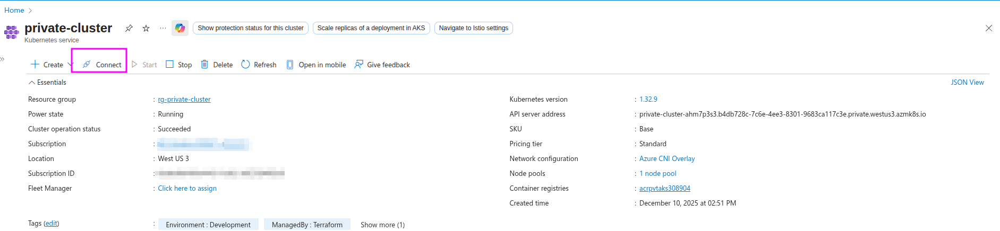
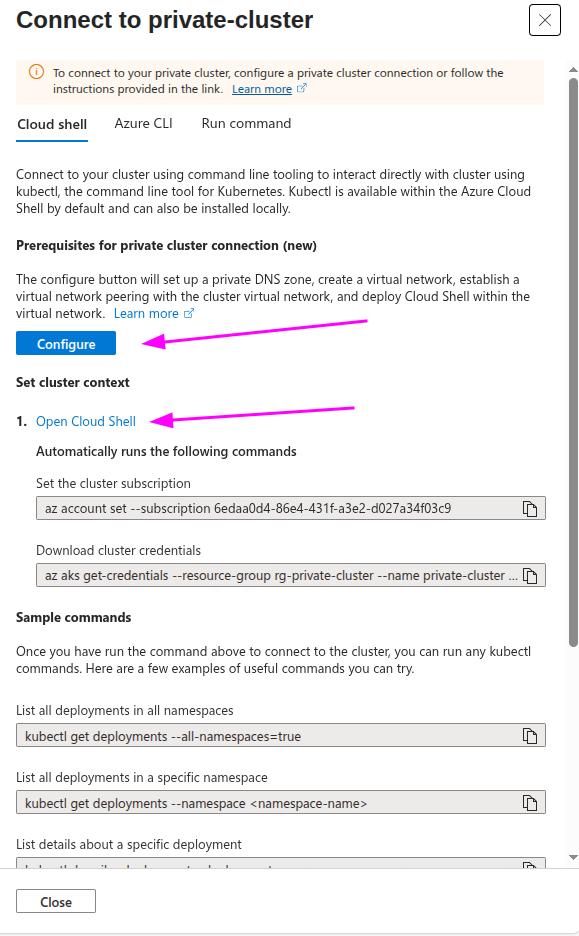
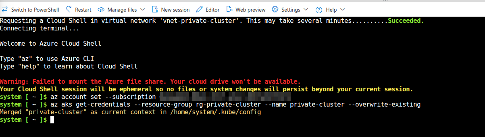

# Private AKS Cluster with Cloud Shell Integration

Deploy a fully network-isolated AKS cluster that you can manage securely through Cloud Shell—no VPN or jumpbox required.

## Quick Start

```bash
cd default
cp terraform.tfvars.example terraform.tfvars
# Edit terraform.tfvars with your values (subscription_id, unique names for storage/acr/relay)
terraform init && terraform apply
# Then configure Cloud Shell VNet integration in Azure Portal (see step 3 below)
```

## What You Get

- **Complete Network Isolation** - No public endpoints, no outbound internet access
- **Cloud Shell Access** - Manage your cluster from anywhere via Azure Portal
- **Built-in Monitoring** - Container Insights with Azure Monitor Agent
- **Entra ID Auth** - No shared credentials, Azure RBAC for access control (local accounts disabled)
- **Workload Identity** - Secure pod-to-Azure service authentication
- **Private Container Registry** - ACR Premium with cached MCR images for bootstrapping
- **Auto-Upgrades** - Kubernetes patches and node images update automatically
- **Azure Policy** - Governance and compliance enabled by default

## Important Notes

### Authentication

- **Local accounts** - Disabled when admin groups are configured; enabled otherwise for development convenience
- **Deployer gets admin access** - The user running `terraform apply` is automatically granted `Azure Kubernetes Service RBAC Cluster Admin` role.
- **Admin groups are optional** - Set `aks_admin_group_object_ids` to grant additional Entra ID groups cluster admin access and disable local accounts. If you need to create a group: `az ad group create --display-name "AKS Admins" --mail-nickname "aks-admins" --query id -o tsv`

### Maintenance Windows

The cluster is configured with automatic upgrades:

| Upgrade Type | Schedule | Window |
|--------------|----------|--------|
| Kubernetes patches | Weekly (Sunday) | 02:00-06:00 UTC |
| Node OS images | Weekly (Sunday) | 06:00-10:00 UTC |

To change these windows, modify the `maintenance_window_*` blocks in `aks.tf`.

### Cost Considerations

- **ACR Premium** (~$50/month) - Required for private endpoints
- **AKS Standard tier** (default) - Includes Uptime SLA; use `aks_sku_tier = "Free"` for dev/test
- **Log Analytics** - Pay-per-GB ingestion; set `log_analytics_retention_days` to control costs
- **Azure Relay** - Standard tier for Cloud Shell connectivity

## Prerequisites

Before you start, make sure you have:

- **Azure CLI** >= 2.61.0
- **Terraform** >= 1.9
- An Azure subscription where you can:
  - Create AKS clusters and managed identities
  - Create private endpoints and DNS zones
  - Register resource providers

## Getting Started

### 1. Set Up Your Variables

```bash
cd default
cp terraform.tfvars.example terraform.tfvars
```

Edit `terraform.tfvars` and update these key values:

```hcl
# Required - your Azure subscription
subscription_id = "your-subscription-id"

# Base names - a unique suffix is auto-generated from your subscription ID
# Example: acrpvtaks → acrpvtaksabc123
acr_name             = "acrpvtaks"
storage_account_name = "stpvtakscs"
relay_namespace_name = "arn-pvtaks"

# Optional - Entra ID group for admin access (recommended)
# Create a group: az ad group create --display-name "AKS Admins" --mail-nickname "aks-admins" --query id -o tsv
aks_admin_group_object_ids = ["your-group-object-id"]

# Optional - override the auto-generated suffix
# name_suffix = "prod01"
```

> The suffix ensures globally unique names. See `terraform.tfvars.example` for all options.

### 2. Deploy Everything

```bash
terraform init
terraform plan
terraform apply
```

This creates about 40 resources and takes ~10 minutes.

### 3. Set Up Cloud Shell VNet Integration

This is the magic that lets you access your private cluster from anywhere.

1. In the Azure Portal, navigate to your cluster and click on **Connect**



1. Next, click on the **Configure** button to setup Cloud Shell for private cluster connection.



1. After a few minutes, you'll have a Cloud Shell instance running inside your VNet accessible from the Azure Portal.

1. Finnaly click on **Open Cloud Shell**



> **Network Note:** Cloud Shell runs in a separate subnet with internet access (required for Azure CLI, package updates, etc.). The AKS subnet remains fully isolated—Cloud Shell can reach the cluster's API server via private endpoint, but cannot reach pods directly over the internet.

## Validation

Run these from **Cloud Shell** (with VNet integration configured).

### 1. Connect and Verify Cluster

```bash
# Get credentials and test connection (use your values from tfvars)
az aks get-credentials --resource-group <resource_group_name> --name <cluster_name>
kubectl get nodes -o wide
kubectl get pods -n kube-system | grep -E "ama|workload-identity"
```

### 2. Verify Network Isolation

```bash
# Verify private DNS resolution (should show 10.x.x.x addresses)
nslookup <acr_name>.azurecr.io

# Test that outbound internet is blocked (should timeout after ~30 seconds)
kubectl run nettest --image=busybox --restart=Never --rm -i --tty=false -- \
  sh -c "wget -T 5 -q -O- http://1.1.1.1 2>&1 || echo 'BLOCKED: No internet access'"
# Expected: "timed out waiting for the condition" = internet is blocked
```

### 3. Verify ACR Cache

```bash
# Check ACR cache rule and cached images (use your acr_name from tfvars)
az acr cache list --registry <acr_name> --output table
az acr repository list --name <acr_name> --output table
```

### 4. Test Container Logs

```bash
# Deploy a test pod that generates logs
kubectl run logtest --image=busybox --restart=Never -- \
  sh -c "while true; do echo \"Test log at \$(date)\"; sleep 10; done"
kubectl get pod logtest -w
```

> Wait 5-10 minutes for logs to reach Log Analytics, then:

```bash
# Query logs (use your resource_group_name and cluster_name from tfvars)
export WORKSPACE_ID=$(az monitor log-analytics workspace show \
  -g <resource_group_name> -n log-<cluster_name> --query customerId -o tsv)

az monitor log-analytics query -w $WORKSPACE_ID \
  --analytics-query "ContainerLogV2 | where PodName == 'logtest' | project TimeGenerated, LogMessage | take 5"

# Clean up
kubectl delete pod logtest
```

## Terraform Outputs

After deployment, these outputs are available:

| Output | What It Is |
|--------|------------|
| `resource_group_name` | Resource group containing everything |
| `cluster_name` | Your AKS cluster name |
| `acr_name` | Container registry name |
| `acr_login_server` | ACR URL for pushing images |
| `oidc_issuer_url` | OIDC issuer for workload identity federation |
| `cloudshell_storage_account_name` | Storage account for Cloud Shell |
| `cloudshell_relay_namespace_name` | Azure Relay for Cloud Shell connectivity |
| `log_analytics_workspace_name` | Where your monitoring data lives |
| `kubeconfig` | Cluster credentials (marked sensitive) |

## Project Structure

```text
default/
├── versions.tf          # Terraform and provider versions
├── variables.tf         # Input variables with validations
├── data.tf              # Data sources
├── resource_group.tf    # Resource group
├── network.tf           # VNet, subnets, NSGs, private DNS zones
├── acr.tf               # ACR, cache rules, private endpoint
├── aks.tf               # AKS cluster, identities, role assignments
├── monitoring.tf        # Log Analytics, Container Insights
├── cloudshell.tf        # Network profile, Relay, Storage, endpoints
├── outputs.tf           # Output values
├── terraform.tfvars     # Your variable values (create from example)
└── terraform.tfvars.example
```

## Tear It Down

When you're done, clean up to avoid charges:

```bash
cd default
terraform destroy -auto-approve
```

## Architecture

```text
┌─────────────────────────────────────────────────────────────────────────────┐
│                            VNet (10.1.0.0/16)                               │
├─────────────────────────────────────────────────────────────────────────────┤
│                                                                             │
│  ┌─────────────────┐  ┌──────────────────┐  ┌─────────────────┐             │
│  │   aks-subnet    │  │ api-server-subnet│  │   acr-subnet    │             │
│  │   10.1.1.0/24   │  │   10.1.2.0/24    │  │   10.1.3.0/24   │             │
│  │                 │  │                  │  │                 │             │
│  │  ┌───────────┐  │  │  ┌───────────┐   │  │  ┌───────────┐  │             │
│  │  │ AKS Nodes │  │  │  │ API Server│   │  │  │  ACR PE   │  │             │
│  │  └───────────┘  │  │  │(delegated)│   │  │  └───────────┘  │             │
│  │      [NSG]      │  │  └───────────┘   │  └─────────────────┘             │
│  └─────────────────┘  └──────────────────┘                                  │
│                                                                             │
│  ┌─────────────────┐  ┌─────────────────┐  ┌─────────────────┐              │
│  │cloudshellsubnet │  │  relaysubnet    │  │storage-pe-subnet│              │
│  │   10.1.4.0/24   │  │   10.1.5.0/24   │  │   10.1.6.0/24   │              │
│  │                 │  │                 │  │                 │              │
│  │  ┌───────────┐  │  │  ┌───────────┐  │  │  ┌───────────┐  │              │
│  │  │Cloud Shell│  │  │  │ Relay PE  │  │  │  │Storage PE │  │              │
│  │  │(delegated)│  │  │  └───────────┘  │  │  │(blob+file)│  │              │
│  │  └───────────┘  │  └─────────────────┘  │  └───────────┘  │              │
│  └─────────────────┘                       └─────────────────┘              │
└─────────────────────────────────────────────────────────────────────────────┘
```

## How It Works

This cluster is **fully network isolated** with blocked outbound internet:

| Setting | Value | What It Does |
|---------|-------|--------------|
| `outbound_type` | `none` | AKS doesn't provision egress infrastructure (no LB, no NAT Gateway) |
| `NSG deny rule` | `DenyInternetOutbound` | Blocks all outbound traffic to `Internet` service tag |
| `bootstrap_profile` | `Cache` | System images pulled from private ACR, not MCR |
| `private_cluster_enabled` | `true` | API server only accessible within VNet |
| `private_dns_zone_id` | `System` | AKS creates and manages the private DNS zone for API server |
| `local_account_disabled` | `true` | No local admin kubeconfig; Azure RBAC only |
| `public_network_access_enabled` | `false` | ACR and Storage not exposed publicly |

### Why Both `outbound_type=none` AND an NSG?

With just `outbound_type=none`, AKS doesn't provision outbound infrastructure, but Azure's fabric routing still allows pods to reach the internet via SNAT. To truly block egress, we add an NSG rule on the AKS subnet:

```hcl
resource "azurerm_network_security_rule" "aks_deny_internet_outbound" {
  name                       = "DenyInternetOutbound"
  priority                   = 4000
  direction                  = "Outbound"
  access                     = "Deny"
  protocol                   = "*"
  destination_address_prefix = "Internet"  # Azure service tag - excludes private IPs
}
```

This blocks internet access while still allowing:

- VNet traffic (private endpoints, peered VNets)
- Azure services via private endpoints (ACR, Storage, Relay)
- Pod-to-pod and pod-to-service communication

### The ACR Cache Rule

For the cluster to bootstrap and upgrade, AKS needs to pull images from Microsoft Container Registry. Since we blocked internet access, we set up an ACR cache rule that mirrors MCR:

```hcl
resource "azurerm_container_registry_cache_rule" "aks_managed" {
  name                  = "aks-managed-mcr"           # Exact name required
  source_repo           = "mcr.microsoft.com/*"       # Exact source required
  target_repo           = "aks-managed-repository/*"  # Exact target required
}
```

> **This cache rule must match exactly** - it's documented in [Microsoft's network isolated cluster guide](https://learn.microsoft.com/azure/aks/network-isolated?pivots=byo-acr). Changing these values will break cluster creation and upgrades.

## Learn More

### Core Concepts

- [Network isolated AKS clusters](https://learn.microsoft.com/azure/aks/concepts-network-isolated) - The concepts behind this pattern
- [Network isolated AKS with BYO ACR](https://learn.microsoft.com/azure/aks/network-isolated?pivots=byo-acr) - Step-by-step guide
- [AKS private clusters](https://learn.microsoft.com/azure/aks/private-clusters) - Private cluster options
- [API Server VNet Integration](https://learn.microsoft.com/azure/aks/api-server-vnet-integration) - How the control plane stays private

### Networking

- [Azure CNI Overlay](https://learn.microsoft.com/azure/aks/azure-cni-overlay) - Why we use overlay mode for pod networking
- [Private endpoints](https://learn.microsoft.com/azure/private-link/private-endpoint-overview) - How services stay private
- [NSG service tags](https://learn.microsoft.com/azure/virtual-network/service-tags-overview) - How we block internet egress

### Security & Identity

- [Workload Identity](https://learn.microsoft.com/azure/aks/workload-identity-overview) - Secure pod-to-Azure authentication
- [Azure RBAC for Kubernetes](https://learn.microsoft.com/azure/aks/manage-azure-rbac) - Authorization with Entra ID
- [Azure Policy for AKS](https://learn.microsoft.com/azure/governance/policy/concepts/policy-for-kubernetes) - Governance and compliance

### Operations

- [Cloud Shell in a VNet](https://learn.microsoft.com/azure/cloud-shell/vnet/overview) - VNet integration setup
- [Container Insights](https://learn.microsoft.com/azure/azure-monitor/containers/container-insights-overview) - Monitoring your cluster
- [Log Analytics](https://learn.microsoft.com/azure/azure-monitor/logs/log-analytics-overview) - Where your logs live
- [AKS pricing tiers](https://learn.microsoft.com/azure/aks/free-standard-pricing-tiers) - Free vs Standard vs Premium
